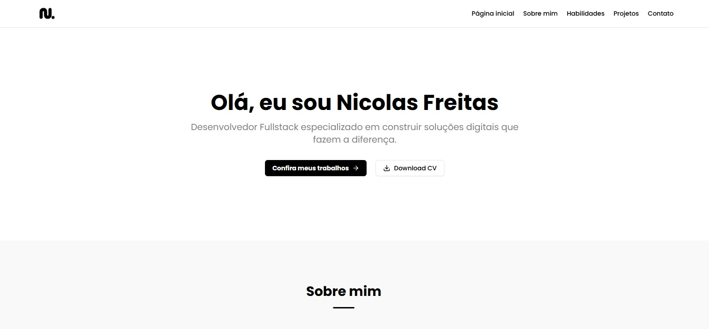

[TYPESCRIPT__BADGE]: https://img.shields.io/badge/typescript-D4FAFF?style=for-the-badge&logo=typescript
[NEXTJS__BADGE]: https://img.shields.io/badge/next_js-0F0F0F?style=for-the-badge&logo=nextjs
[TAILWINDCSS__BADGE]: https://img.shields.io/badge/TAILWINDCSS-F8F9FA?style=for-the-badge&logo=TAILWINDCSS
[LUCIDE_REACT__BADGE]: https://img.shields.io/badge/LUCIDE_REACT-F56565?style=for-the-badge&logo=LUCIDE_REACT
[SHADCNUI__BADGE]: https://img.shields.io/badge/SHADCN_UI-0F0F0F?style=for-the-badge&logo=SHADCNUI
[PROJECT__BADGE]: https://img.shields.io/badge/VISITE_ESTE_PROJETO-0F0F0F?style=for-the-badge&logo=VISIT_PROJECT
[PROJECT__URL]: https://nicolasfreitas.vercel.app/

<h1 align="center" style="font-weight: bold;">Portfólio 💻</h1>

![nextjs][NEXTJS__BADGE]
![typescript][TYPESCRIPT__BADGE]
![TAILWINDCSS][TAILWINDCSS__BADGE]
![LUCIDE_REACT][LUCIDE_REACT__BADGE]
![SHADCNUI][SHADCNUI__BADGE]

<p align="center">
 <a href="#about">Sobre o projeto</a> • 
 <a href="#started">Como utilizar o projeto</a>
</p>



<h4 align="center">🚧 Projeto em construção...  🚧</h4>

<h2 id="#about">📌 Sobre o projeto</h2>

<p>
    Portfólio profissional com design simples e moderno, desenvolvido utilizando tecnologias atuais no mercado para demonstrar minhas habilidades e projetos.
</p>

[![project][PROJECT__BADGE]][PROJECT__URL]

<h2 id="started">🚀 Como utilizar o projeto</h2>

<h3>Requisitos</h3>

Para rodar este projeto na sua máquina será necessária que tenha instalado NodeJS para realizar a instalação das dependências e GIT para clonar este repositório.

- [NodeJS](https://nodejs.org/pt)
- [GIT](https://git-scm.com/downloads)

<h3>Clonando</h3>

Como clonar o projeto na sua máquina

```bash
git clone https://github.com/nicolasfreitas-dev/portfolio-next.git
```

<h3>Acesse o diretório do projeto</h3>

```
cd portfolio-next
```

<h3>Instalando dependências</h3>

```
npm install
```

<h3>Iniciando o projeto</h3>

```
npm run dev
```